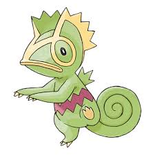

<table>
    <thead>
        <tr>
            <th>Image</th>
            <th>Title</th>
            <th>Description</th>
            <th>Reference</th>
        </tr>
    </thead>
    <tbody>
         <tr>
            <td></td>
            <td>
              Kaggle
              
              Data Science
              
            </td>
            <td>A collection of Kaggle notebooks and competition submissions created by me.</td>
            <td><a target="_blank" href="https://github.com/Henesys/Kaggle">GitHub</a></td>
        </tr>
         <tr>
            <td></td>
            <td>
              Project 2
              
              Data Analytics
              
            </td>
            <td>Description 2</td>
            <td><a target="_blank" href="https://github.com/Henesys">Link 2</a></td>
        </tr>
        <tr>
            <td></td>
            <td>
              Project 3
              
              Machine Learning
              
            </td>
            <td>Description 3</td>
            <td><a target="_blank" href="https://github.com/Henesys">Link 3</a></td>
        </tr>
    </tbody>
</table>
